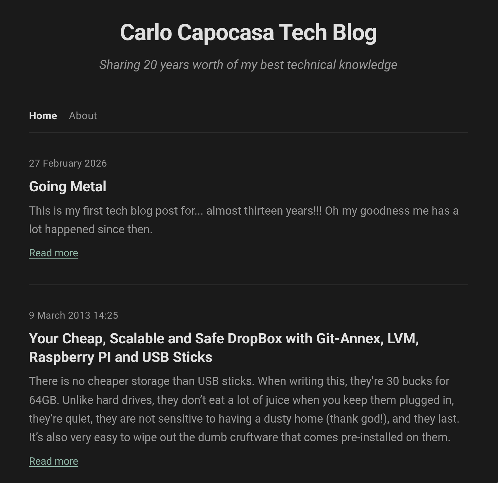
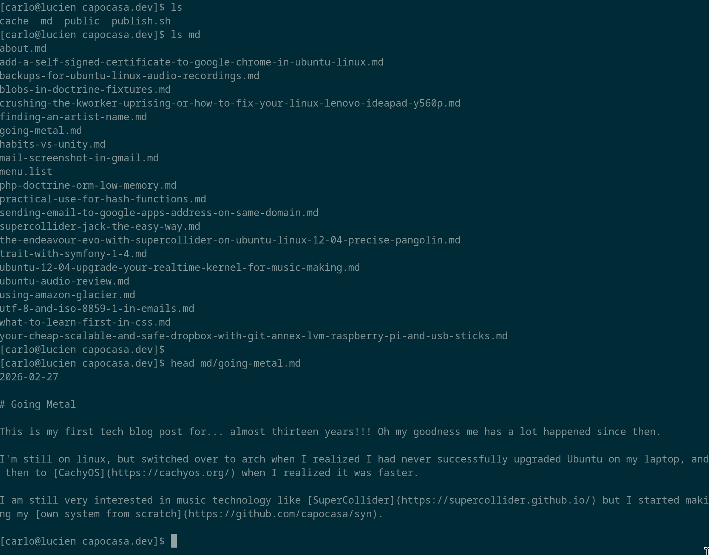

# blg

blg is a simple but enjoyable blog generator (for now) especially for command line users.

# Installation

Requires [Nim](https://nim-lang.org/).

    nimble install blg

It's designed to use very simple, distraction-free markup files and the filesystem as an interface.

- Symlinks as tags
- Automatic or custom nav bar
- Clean default theme
- Customizable in Nim
- command line and daemon

# Basic usage

Create a directory somewhere.

    $ export DIR=~/writing/myblog
    $ mkdir -p $DIR
    $ cd $DIR

Add an 'md' directory in there.

    $ mkdir md

Now create a basic blog file. Date on top, make your own title, write the text, filename is the slug.

    $ echo "2026-01-01
    
    # My first post!
    
    Yeah, I'm writing a post alright!
    " > md/my-first-post.md

Of course you would normally just use some kind of editor you like- vim, emacs, and I guess there are a few other options :-)

Now run blg and look at your blog in the new public/ directory.

    chromium public/index.html

That's it! Put it in your server. (Or run the whole thing on your server if you prefer)

    rsync -av --delete public/ myuser@myserver:/var/www/myblog.net

# Tags

One you have more than one blog post- and maybe even a few dozen- it can be nice to tag your posts so people can access them by interest. To do this, create a sub-directory of `md` with a catchy tag name in snake case, like "cookie-recipes"- or "irrational-systemd-outbursts", if you prefer. It's your blog.

    $ export TAGNAME=irrational-systemd-outbursts
    $ mkdir md/$TAGNAME
    $ cd md/$TAGNAME
    $ ln -s ../why-i-will-never-switch-from-initd-in-my-life.md
    $ ln -s ../they-can-pry-my-initd-from-my-cold-dead-hands.md
    $ ln -s ../systemd-grinds-my-gears.md
    $ ln -s ../why-does-lennart-not-care-linus-is-mad.md
    $ cd ../..

And then, to loosen things up, another

    $ export TAGNAME=cookie-recipes
    $ mkdir md/$TAGNAME
    $ cd md/$TAGNAME
    $ ln -s ../brownies.md
    $ ln -s ../oat-cookies.md
    $ ln -s ../shortbread.md

Now if you recreate your blog,

The menu will look like this:

Home | Irrational Systemd Outbursts | Cookie Recipes

Thanks to your tag based menu, your readers will be easily able to choose if they would prefer to read about pastries or systemd hate!

# Pages

Some information is about time, like the things you are doing using language models, which will be obsolete tomorrow. Other things are more constant during your lifetime, like your name. If you would like to mention your name, it is usually good practice to have an about page. With blg, "About" is a special word, so you just add yourself an about.md page and you're good.

    $ echo "# About

    It is I, Carlo!" > md/about.md
    blg

Your menu now reads

Home | Irrational Systemd Outbursts | Cookie Recipes | About

Now everyone knows exactly who it is who is offering such deliciously cathartic information.

Since About is linked directly from the menu, it will be shown as a page, without a date. It also won't appear in the post list.

# Custom menu

As you now probably have read but do not fully understand yet- don't worry it's normal, I didn't understand at first and I made this- by default, blg creates a menu for you.

Home | Tag | Another Tag| About

But, of course, you might not want *all* tags in the menu, or you might want a different order, or a mix of tags and pages.

To get your custom menu, create a file `menu.list` in your `md` directory. On each line, place "Home" or the name of a tag or post to create the link.

    Home
    Cookie Recipes
    About

Now we have a menu tag for cookie recipes, and the systemd tag still exists, but it's not featured in the menu, you have to find one of the posts to access it, so it's less emphasized. Maybe that's for the best...

# Page only web site

There's nothing stopping you from just creating a web site, no index, all posts are pages.

    $ mkdir md
    $ echo "# Me

    This page is about me" > md/me.md
    $ echo "# Myself

    This page is about myself" > md/myself.md
    $ echo "# I

    This page is about I" > md/i.md
    $ echo "Me
    Myself
    I" > md/menu.list
    $ blg

Now you have a proper web site that really hammers home that it's about you. What is there not to like?

## Title and tagline

It's of course good to know which of the gazillion blogs on the internet a user is on- yours of course!

Some configuration options are usually only set once per blog, so it's good to create a `.env` file to set them

    # .env
    BLG_SITE_TITLE=Me, Myself and I
    BLG_SITE_DESCRIPTION=The finest source of all you ever wanted to know about yours truly

Now this will be output, nice and large, at the top, and in the page titles.

## Directories

If you're running blg on a server, you might want to flex all that unix muscle you have accumulated in all those years of training your keyboard. Then, of course, you would want custom directories for your markdown files, and directly specify your web root as the target. You can use command line switches for this, but it's probably easier to just put it in an .env file. There is also a cache dir with intermediate information you can put where you consider it the most well known- as if you'd let anyone else on your server!

    $ mkdir -p /var/lib/blg/mysite.net
    $ mkdir -p /var/cache/blg/mysite.net
    $ mkdir -p /var/www/mysite.net

    # .env
    BLG_INPUT=/var/lib/blg/mysite.net
    BLG_CACHE=/var/cache/blg/mysite.net
    BLG_OUTPUT=/var/www/mysite.net

## Blog-style URLs

By default, blg makes nice .html files that you can just dump into any web server and it will work. But you- you might be way beyond that in your refined tastes. You might want to have real blog style URLs that don't end in .html. Even though your site is static! I mean it! Are you ready? Yes? Okay here we go!

;-)

So there are two parts to this. First, you need to *generate* HTML files that have no extension. You do that by adding another variable to .env. This sets the blog extension to nothing. (You could also set it to .htm if you vibe like the early 90s but the main use case is probably to have it empty)

    # .env
    BLG_EXT=

Now if you run blg, all your html files will have no extension.

Note: Delete the existing html files from your public folder manually after making the change.

This is pretty good, but the catch here is that it doesn't work by default on your web server, you need to configure it. Here is a snippet to do that with nginx
    # /etc/nginx/sites-available/mysite.net.conf
    server {
      server_name mysite.net;
      listen 80;  # add your site's SSL configuration too
      
      # Add extensionless index page as index
      index index index.html;
    
      # Strip trailing slash from files only
      location ~ ^(.+)/$ {
        set $path_without_slash $1;
        if (-d $document_root$path_without_slash) {
          rewrite ^ $path_without_slash/index last;
        }
        if (-f $document_root$path_without_slash) {
          return 301 $path_without_slash;
        }
        rewrite ^ $path_without_slash/index last;
      }
    
      # Serve extensionless files as HTML
      location ~ "^(/|.*/)[^./]+$" {
        default_type text/html;
        set $add_slash "";
        if (-d $request_filename) {
          set $add_slash "1";
        }
        if ($uri ~ /$) {
          set $add_slash "";
        }
        if ($add_slash) {
          return 301 $uri/;
        }
        try_files $uri /index$is_args$args;
      }
    
      # Add trailing slash to directories
      location / {
        set $add_slash "";
        if (-d $request_filename) {
          set $add_slash "1";
        }
        if ($uri ~ /$) {
          set $add_slash "";
        }
        if ($add_slash) {
          return 301 $uri/;
        }
        try_files $uri /index$is_args$args;
      }
    }

So you can see that the server configuration part can be a bit tricky to get this done, but it's mostly boilerplate and it does work. So you just set it up once and you're good.

Static site pretty URLs!

## Proper blog style absolute links

So one thing a lot of blogs do is put absolute links into the blog pages, so all your links point to `mysite.net/mypage` instead of just `mypage`. Since blog posts get all sorts of content extraction happening, or you might be read in an RSS reader or your blog might get mirrored by all sorts of people, if you use absolute URLs, folks keep coming back to your proper blog as soon as they click a link. (content hoarders are lazy so it's good if your site does what you want by default).

As so many things, this is just one `.env` var away.

    # .env
    BLG_BASE_URL=https://mysite.net/  # mind the https, and trailing slash

    # regenerate all pages after change
    $ blg -f

Now your blog has proper absolute URLs. You probably want to keep using relative URLs in your markdown files.

This is, however, a bit of a pain for testing your blog on a test server or locally. That's why I recommend this. Have your blog on a local machine, and don't set BLG_BASE_URL in .env, but override it before publishing.

    # publish.sh
    export BLG_BASE_URL=https://mysite.net
    blg -f
    rsync -av --delete public/ root@mysite.net:/var/www/mysite.net  # or whatever you use to upload

## Pretty pictures

You can have images in your markdown. You can place them anywhere in `public/`, they won't get overwritten, and just link to the file name. If you prefer, you can also create a `public/assets` folder or similar, and link to `assets/mylogo.png` in your markdown.

## Daemon mode

One thing I ended up using less than expected but it is there is daemon mode. Instead of running blg, you can run it with blg -d and it will regenerate your site everytime you save a file.

    $ blg -d

Saved you a click!

## Styling

By default, blg writes a default style sheet into public/style.css. This is only done once on the first run, so you can edit it as much as you like. (To reset to default, make a dummy blog in /tmp and get that style.css). Nothing except the HTML files gets overwritten by blg, so you can put images, fonts and any other assets into the public folder. You can have sub-directories like `assets/` or `images/` or you can put everything directly into public, both work fine. Personally I'm too busy to worry about folder hierarchy so I just use `public/`.

At the moment, blg only comes with one theme, but it's relatively straightforward to adapt existing HTML

## Templating

Note: Advanced usage!

Here's where it gets fancy. blg uses Nim source code filters as templates, simply because I think it's weird to have a full on extra stateful programming language with loops and everything for templating that happens in runtime when what I really want to do is write Nim, and have programs run in machine code. And rendering a template definitely is a program.

For this reason, blg has an override mechanism for all templating procedures. You can find the full list by looking into src/blg/templates/helpers.nimf. These are all procedures that return strings.

So what you do is you create a directory called templates in your blog folder, and add file called templates.nim. In there, you can copy any template procedure from the source, and edit it to do what you want it to do.

See docs for procedure definitions.

## Fancy plans

I have lots of ideas! I do intend to implement them.

- [ ] WYSIWYG web editor
- [ ] internationalization
  - [ ] language support
  - [ ] multilanguage sites
- [ ] multisite daemon
- [ ] RSS
- [ ] Windows support
- [ ] Mac support
- [ ] More themes

# License

MIT

