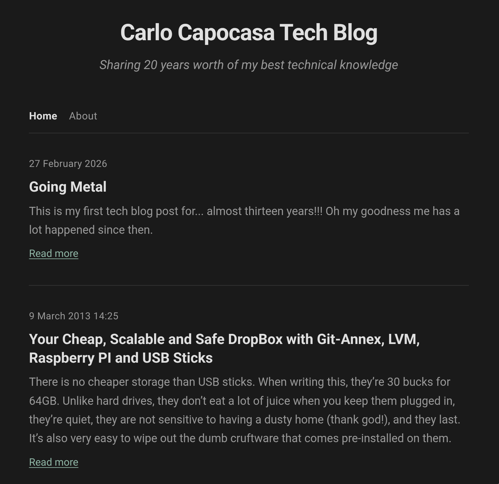
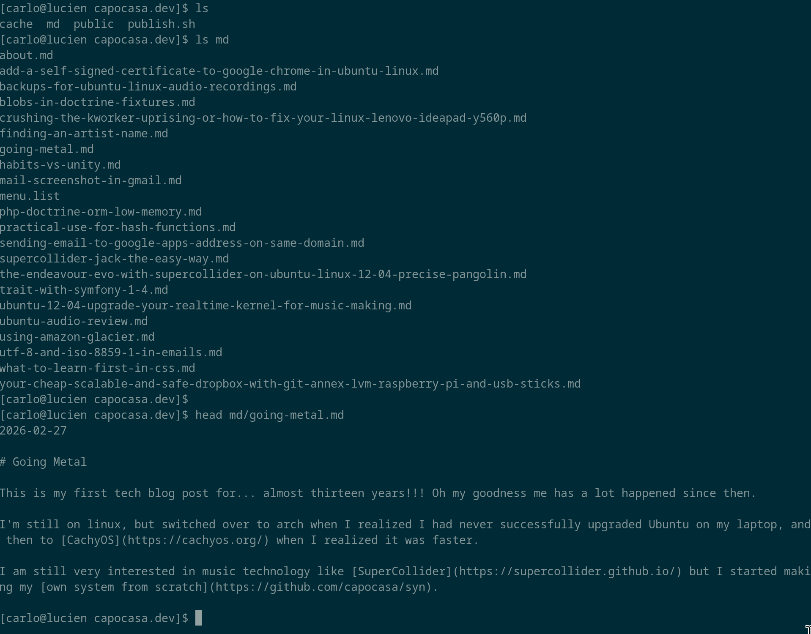

# blg




blg is a simple but enjoyable blog generator, especially for command line users. Markdown files in, blog out. Symlinks are tags. Home page: [blg.capocasa.dev](https://blg.capocasa.dev/).

# Installation

One binary, one line. Linux:

    mkdir -p ~/.local/bin && curl -fsL https://github.com/capocasa/blg/releases/latest/download/blg-linux-amd64 -o ~/.local/bin/blg && chmod +x ~/.local/bin/blg

macOS: same line with `blg-macos-universal` (universal binary).

Windows: grab `blg-windows-amd64.zip` from the [releases](https://github.com/capocasa/blg/releases) — it carries the OpenSSL DLLs the updater needs.

Release binaries update themselves in the background; set
`BLG_AUTO_UPDATE=false` to opt out. From source (requires
[Nim](https://nim-lang.org/), auto-update stays off):

    nimble install blg

# Quickstart

    $ mkdir myblog && cd myblog
    $ mkdir md
    $ echo "2026-01-01

    # My first post!

    Yeah, I'm writing a post alright!
    " > md/my-first-post.md
    $ blg

Your blog is now in `public/`. Serve it with anything:

    $ rsync -av --delete public/ myuser@myserver:/var/www/myblog.net

Posts are markdown files: first line is the date, filename is the slug. Tags are directories of symlinks:

    $ mkdir md/tutorials
    $ ln -s ../my-first-post.md md/tutorials/my-first-post.md
    $ blg

Run `blg -h` for options; it fits on one screen, which is the point.

Bare URLs in your markdown are linkified automatically, so this:

    The manual is at https://blg.capocasa.dev/manual.html.

renders as a link where the URL is both the text and the href. URLs inside
code spans, fenced code blocks, and existing `[text](url)` links are left
alone.

# Configuration

`blg.conf` in the working directory, or point somewhere else with `-C`:

    [site]
    title = My Blog
    description = A blog about code

    [files]
    extension = html      # "" for extensionless URLs

The parser is strict: unknown or duplicate sections and keys and invalid
values are errors. A typo should fail the build, not quietly ignore your
config. Everything else is a switch (`blg -h`) or an environment variable
(`BLG_BASE_URL`, `BLG_DATE_FORMAT`, ...).

# Documentation

The full manual (tags, pages, custom menus, pretty URLs, styling,
backgrounds, scoped assets, templating, config reference) lives at
[blg.capocasa.dev/manual.html](https://blg.capocasa.dev/manual.html).

# Changelog

```
0.3.2    Bare binaries as release assets, one-liner install, embedded CA bundle
0.3.1    blg.conf config file replaces .env: site title/description, output extension, strict parsing
0.2.0    Scoped assets, backgrounds, OG tags, RSS, sitemap, preview fix
0.1.0    Initial release
```

# License

MIT
